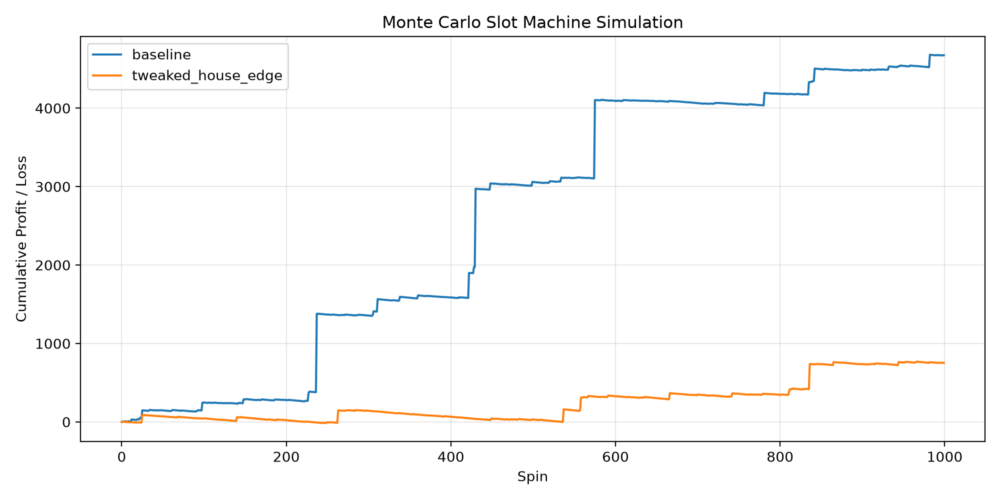

# Double Diamond Simulation

## Overview

This project contains a playable slot machine implemented in `main.py` and a Monte Carlo simulator in `simulation.py`.

- `main.py` launches a simple Pygame slot machine UI.
- `simulation.py` runs repeated spins and saves a performance plot to `assets/simulations/slot_simulation.png`.

## Paytable

 matches any other symbol on the payline.\
Wins with exactly one  pay **2x** the regular win amount.\
Wins with exactly two  pay **4x** the regular win amount.

## Wins

|                                                                  |   3   | Any 2  | Any 1  |
| :--------------------------------------------------------------: | :---: | :----: | :----: |
|  | 1000x |   -    |   -    |
|  |  80x  |   -    |   -    |
|  |  40x  |   -    |   -    |
|  |  25x  |   -    |   -    |
|  |  10x  |   -    |   -    |
|  |  10x  |   5x   |   2x   |
|  |  5x   |   -    |   -    |

## Setup

1. Open a terminal in the project root folder.
2. Create a virtual environment.

   Windows PowerShell:
   ```powershell
   python -m venv .venv
   .\.venv\Scripts\Activate.ps1
   ```

   Windows CMD:
   ```cmd
   python -m venv .venv
   .\.venv\Scripts\activate
   ```

   macOS / Linux:
   ```bash
   python3 -m venv .venv
   source .venv/bin/activate
   ```
3. Install dependencies:
   ```bash
   python -m pip install --upgrade pip
   python -m pip install -r requirements.txt
   ```

## Running the program

Run the playable slot machine UI:

```bash
python main.py
```

Run the Monte Carlo simulation:

```bash
python simulation.py
```

When `simulation.py` finishes, it saves a chart to:

```text
assets/simulations/slot_simulation.png
```

## Simulation output and inference

The simulation chart shows profit/loss over each spin for the configured scenarios.

- A rising line means the player is winning more than they bet over time.
- A falling line means the player is losing more than they win over time.
- Steeper drops indicate a stronger house edge.
- If the line stays near zero, the game is closer to break-even.

Use the printed summary from `simulation.py` to interpret results:

- `final_balance` is the net result after all spins.
- `mean_per_spin` is the average win/loss per spin.
- `stddev` measures how much each spin outcome varies.
- `min` and `max` show the worst and best observed outcomes.

## Example


